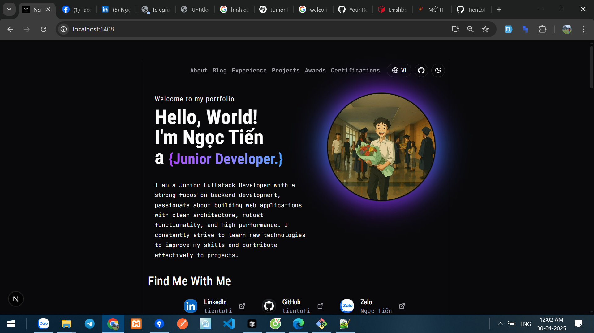

Here is the **shortened and updated English version** of your README, with the name changed from **chanhdai** to **ngọc tiến** (and domain kept as-is for now):

---

# ngoctien.dev

**[ngoctien.dev](https://ngoctien.com)** is my personal portfolio website showcasing my projects and experience as a **Junior Fullstack Developer**, with a strong focus on backend development. Built with [Next.js](https://nextjs.org), [Tailwind CSS](https://tailwindcss.com), and [shadcn/ui](https://ui.shadcn.com), it delivers a fast and modern user experience.

<picture>
  <source media="(prefers-color-scheme: dark)" srcset="./public/screenshot-wide-dark.webp">
  
</picture>

## 🔧 Key Features & Tech

- Clean, minimal UI with dark mode support
- SEO-friendly (sitemap, JSON-LD, robots.txt)
- Email obfuscation to reduce spam
- Digital vCard integration
- Installable as a PWA
- Blog with MDX, syntax highlighting & RSS
- Dynamic OG images for social previews

## 🚀 Tech Stack

- **Next.js 15**
- **Tailwind CSS v4**
- **shadcn/ui**
- **Radix UI**, **Lucide**, **Motion.dev**

## 🔒 License

Released under the [MIT License](./LICENSE).
Feel free to use this code for your own project — just remove my personal info before publishing!

---
